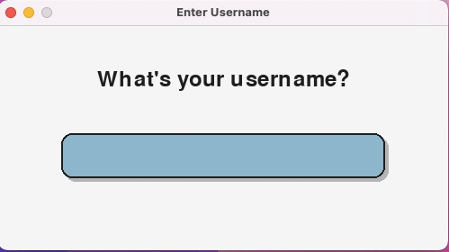
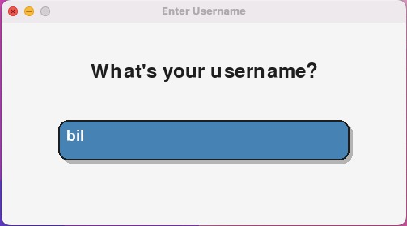
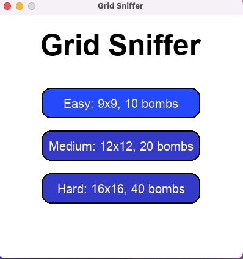
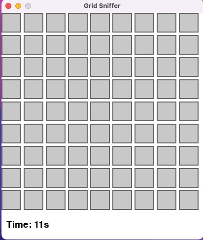
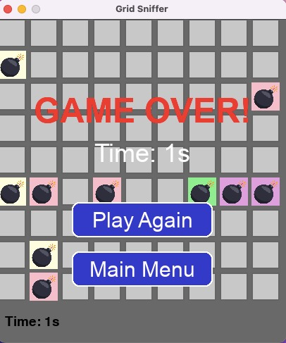
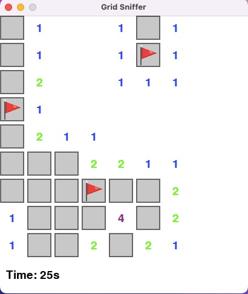
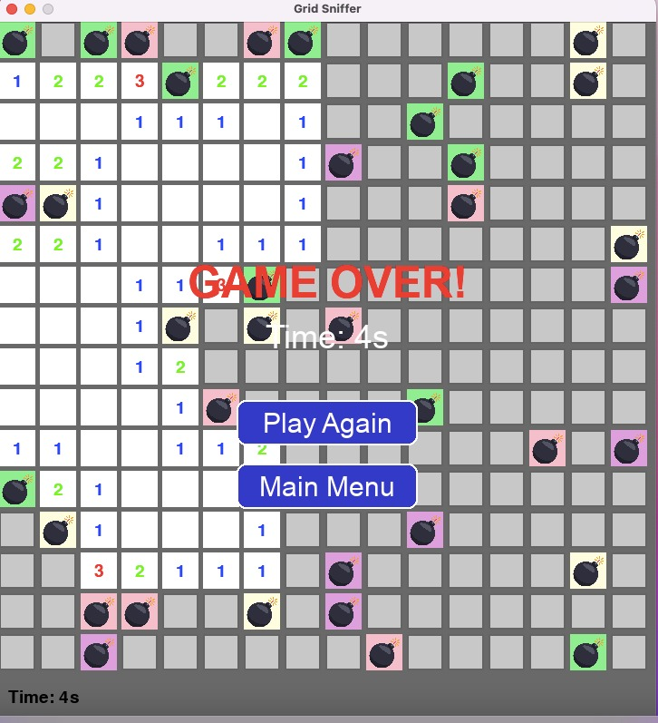

# 🧨 Grid Sniffer – Sniff the Grid, Dodge the Boom!

Welcome to **Grid Sniffer**, a fun little Minesweeper-style game where your job is to dig safe spots and avoid hidden bombs 💣. Use your brain, your instincts, and maybe a bit of luck to sniff out all the safe tiles!

---

## 🎮 How to Play

- ⛏️ **Left-click** to dig  
- 🚩 **Right-click** to flag  
- 💣 **Click a bomb** = Game Over  
- ✅ **Clear all safe cells** = You Win!  

---

## 🔧 Features

- 🟢 Easy, Medium, Hard levels  
- ⏱️ Timer & sound effects (if available)  
- 💣 Bombs & 🚩 flags shown using images or emojis  
- 🔁 Play again or return to the menu after each round  

---
## 📸 Screenshots

<p float="left">
  
  
</p>

<p float="left">
  
  
  
  
</p>

<p float="left">
  
</p>


## ▶️ How to Run

1. ✅ Install Python 3  
2. ✅ Install Pygame: pip install pygame
3. ✅ Run the game: python grid_sniffer.py

## 📁 Files
    ```txt
      grid_sniffer/
      ├── grid_sniffer.py       # Main game file
      ├── assets/               # Images and sounds
      └── README.md             # This file
      
Made for fun and learning. Try not to boom 💣!

      


